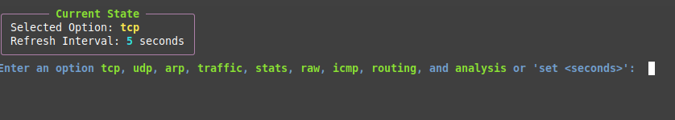
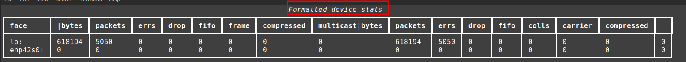

# netmonitor
A command-line application that uses the proc directory to analyze the network traffic generated and received by a process. 

### Purpose
The purpose of this program is to learn how the /proc file system works. Specifically, the directory of a process /proc/[\pid\]/net is studied and leveraged to display the network activities of a process. A Tangible user interface (TUI) program is developed which uses the  /proc/[\pid\]/net directory to monitor the network activities of a process chosen by the user. 

### Installation
Make sure Python’s rich library is installed on your system. 
Run either of the following commands to install the rich library (in case one of the commands doesn’t work):

pip install rich 
sudo apt install python3-rich 

### Running
Execute the following command on a terminal to start the program:
python3 netmonitor.py <\PID\>

### Command Line Arguments
| Variable | Purpose                            |
|----------|------------------------------------|
| pid      | The pid of the process to monitor  |

## Examples
### Starting
The following figure shows an instance of starting the program on the command line:

### Selecting a Tab
The following figure shows an instance of selecting a tab:

### Terminating 
The following figure shows an instance of terminating the program by pressing CTRL+D key combination:

#### Data Types
##### Arguments
Purpose: To hold the unparsed command-line argument information
| Field     | Type | Description         |
|----------|------|---------------------|
| argv     | str  | The arguments       |
| argv[\0\]  | str  | File name           |
| argv[\1\]  | str  | PID of program.     |

##### Context
Purpose: To hold the arguments, settings, and exit information
| Field           | Type | Description                                         |
|----------------|------|-----------------------------------------------------|
| refresh_interval | int  | Period in seconds when the values are refreshed.    |

##### States
| State         | Description                                               |
|---------------|-----------------------------------------------------------|
| START         | Program started.                                          |
| NO_PID        | PID not provided as a command line argument.              |
| INVALID_PID   | Invalid PID given.                                        |
| FAIL_EXIT     | Program exits due to improper configuration.              |
| NO_SELECTION  | User has not made a selection yet.                        |
| TAP_SELECTED  | One of the tab options has been selected by the user.     |
| REFRESHING    | Current tab selected is being refreshed.                  |
| TERMINATED    | Program session terminated by the user.                   |

##### State Table
| From State     | To State       | Function            |
|----------------|----------------|---------------------|
| START          | NO_PID         | main()              |
| START          | INVALID_PID    | main()              |
| NO_PID         | FAIL_EXIT      | main()              |
| INVALID_PID    | FAIL_EXIT      | main()              |
| START          | NO_SELECTION   | session()           |
| NO_SELECTION   | TAP_SELECTED   | posix_net_monitor() |
| NO_SELECTION   | REFRESHING     | session()           |
| REFRESHING     | TAP_SELECTED   | posix_net_monitor() |
| TAP_SELECTED   | TERMINATED     | main()              |

##### State Transition Diagram

## Testing
| Test                                                                 | Expected             | Actual                |
|----------------------------------------------------------------------|----------------------|------------------------|
| Running the program and not not providing the PID as the command line argument. | Terminate gracefully | Terminate gracefully  |
| Running the program and providing an invalid PID as the command line argument. | Terminate gracefully | Terminate gracefully  |
| Killing the process being monitored while the program is running.   | Terminate gracefully | Terminate gracefully  |
| Happy path: normal usage.                                           | Works properly       | Works properly        |

## Walk-through

##### Primary Objective 
The objective of this assignment was to familiarize oneself with the proc file system. Specifically, the /proc/[\pid\]/net directory and all its child files and directories were vigorously studied. The /proc/[\pid\]/net directory was used to analyze the network traffic generated and received by an individual process. 

##### Scope
The scope of this assignment was to understand every file and directory under /proc/[\pid\]/net directory and understand how they can be used to detect network anomalies. 

##### Implications for Cybersecurity 
Understanding the inner workings of /proc/[pid]/net directory allows network admins to detect anomalies which could be a sign of a system being compromised. Also, it can be used to troubleshoot networking issues for each individual process without being overwhelmed with the entire system network traffic.  

##### Ethical Guidelines
This assignment was done on a personal device and no third party devices were involved. As a result, this assignment has been conducted while adhering to all ethical guidelines. 

#### Tabs
The program has 9 tabs. The following table explains each tab:

| Tab      | Description |
|----------|-------------|
| tcp      | Shows information about the active TCP connections such as local and remote address and port. |
| udp      | Shows information about the active UDP connections such as local and remote address and port. |
| arp      | Shows the ARP cache on the system. Also, it shows information about ARP operations such as numbers of entries, failed ARP lookups, and such. |
| traffic  | Displays information about the network traffic on each network interface card. This includes the number of processed packets, errors, packets dropped and such. |
| stats    | Shows generic networking information about the process. It shows three long tables. |
| raw      | Displays information about the raw sockets. |
| icmp     | Displays information about ICMP packets. |
| routing  | Displays information about routing such as destinations, gateways, MTU and such. |
| analysis | Displays a few comprehensive tables filled with information about the process’s networking activities. This includes forwarding metrics, incoming packets’ metrics, The Retransmission Timeout (RTO) algorithm metrics, datagram metrics. |

Once all the instructors have been read, press any key to start the interactive session. TCP options are selected by default and will be displayed after the default time interval has passed. 

The following shows the screen when any key has been pressed, and the interactive session has been started: 

The rectangular box shows the current tab selected and the refresh time interval chosen. In order to change the refresh time interval run the command `set <time interval in seconds>`, e.g., set 6. 

The following shows an instance how to change the refresh time interval to 6 seconds: 

Note: Pressing CTRL+D key combinations at anytime stops the interactive session. 

After the time interval has passed and if the user has not selected any tabs, the default tab will be displayed which in this case in tcp as follows: 

##### TCP tab
This tcp tab displays the active TCP connections of the process. It shows the state of each TCP connection. Also it shows the address and port of the local host and the remote host. 
The following figure shows the columns pertaining to local and remote address and port binding and the state of each TCP connection: 

##### UDP tab
This udp tab displays the active UDP connections of the process. It shows the state of each UDP connection. Also it shows the address and port of the local host and the remote host.

The following figure shows the columns pertaining to local and remote address and port binding and the state of each UDP connection: 

##### ARP tab
This arp tab shows the ARP cache and information about ARP operations. 
The following table shows the ARP cache of the system: 

The following figure shows the ARP table:

##### Traffic
This traffic tab shows the packet traffic stats for each network interface. This includes processed packets, errors, dropped packets, collisions and such. The following table shows the “device packet stats” table: 

##### Stats
General networking information. The following following figure shows the truncated “TcpExt” table: 

The following figure shows the “IPExt” table:

The following table shows the truncated “MPTcpExt” table: 

##### Raw
This raw tab shows details about the raw sockets.
The following figure shows the raw table: 

